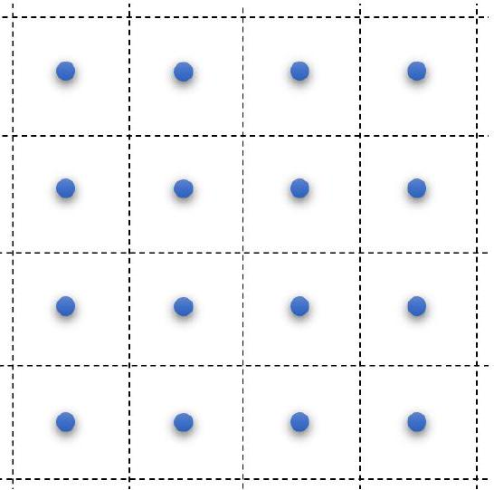
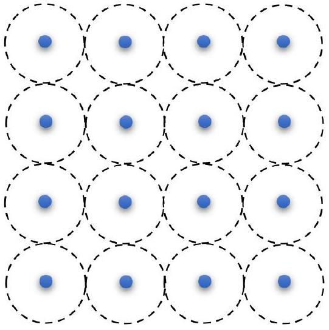
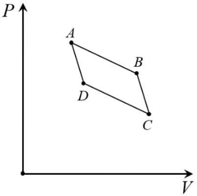

## Problem 2. Thermodynamics of one-component plasma ( $\mathbf{1 0 . 0}$ points)

Plasma, considered a fourth state of matter, is an ionized gas containing electrons, ions and neutral particles. In a plasma, particle concentrations and temperatures vary over a very wide range, so that a great variety of physical effects can play an essential role. Therefore, at present, a great deal of plasma models have been developed, and this problem deals with one of them, which is called a one-component plasma model. Namely, let us consider a fully ionized plasma with no neutral particles present, which consists of positively charged deuterium nuclei moving against a neutralizing uniformly charged background formed by electrons. This model is a very good approximation for ultrahigh-pressure plasmas occurring at the center of white dwarfs and giant planets like Jupiter. Let the charge and the mass of deuterium nuclei be $e=1.602 \cdot 10^{-19} \mathrm{Cl}$ and $m=3.44 \cdot 10^{-24} g$ respectively, and their concentration be $n=1,62 \cdot 10^{27} s m^{-3}$ at temperature $T=1.76 \cdot 10^{4} K$. Under these conditions, an essential role is played by the interaction between deuterium nuclei, which are located at the sites of a cubic lattice, whose two-dimensional projection is shown in Figure 2.1. Plasma must preserve its neutrality, therefore, each cube with a nucleus located in its center is neutral and referred to as a unit cell. The field produced by each cubic cell is rather complicated, and instead the system is formally reduced to spherical cells, whose two-dimensional projection is depicted in Figure 2.2. The justification of such a replacement is not obvious and depends on the type of problems under investigation.

In numerical calculations, consider the following known: Boltzmann's constant $k_{B}=1.38 \cdot 10^{-23} J / K$, the vacuum permittivity $\varepsilon_{0}=8,85 \cdot 10^{-12} \mathrm{~F} / \mathrm{m}$.

Figure 2.1. Two-dimensional projection of a onecomponent plasma model with cubic cells.

Figure 2.2. Two-dimensional projection of a onecomponent plasma model with spherical cells.

2.1 Calculate the smallest distance $a$ between neighboring nuclei.
2.2 Show that interaction energy between nuclei plays a significant role under the given conditions. To do this, estimate the ratio $\Gamma$ of the interaction energy of neighboring nuclei to their thermal energy. Neglect the presence of a neutralizing background.
2.3 Calculate the bulk charge density $\rho$ of a spherical cell in a one-component plasma model.
2.4 Calculate the potential difference between two points of a spherical cell located at distances $a / 2$ and $a / 4$ respectively.
2.5 Calculate the frequency of small oscillations $\omega_{p}$ of a nucleus near the equilibrium position in a spherical cell.
2.6 At the given plasma temperature, estimate the rms amplitude $A$ of oscillations of nuclei near their equilibrium position.
2.7 The internal energy $U$ of a one-component plasma, containing $N$ spherical cells in the volume $V$, has the form

$$
U=\alpha_{1} N+\alpha_{2} \frac{N^{4 / 3}}{V^{1 / 3}} .
$$

Determine constants $\alpha_{1}$ and $\alpha_{2}$.

The plasma state of matter is a promising working body for the controlled nuclear fusion. The main problem in the implementation of nuclear fusion is to overcome the so-called Coulomb barrier, which is the Coulomb repulsion between positively charged nuclei. Note that the presence of the neutralizing background of nuclei results in lowering of the Coulomb barrier, since the repulsive force between nuclei decreases. Consider the process of two fusing cells, which occurs as follows. Two cells fuse into one spherical cell with the same bulk density of the neutralizing background, and a new nucleus appears in its center, formed by the fusion of two initial nuclei.
2.8 Calculate the Coulomb barrier lowering for the fusion of two deuterium nuclei cells under given conditions.

The expression for the internal energy of a one-component plasma in the vell model in 2.7 above is interesting in that it explicitly depends on the volume, which is characteristic for nonideal systems. Let a thermodynamic state of the system, whose composition remains unchanged, be depicted by a dot on the pressure $(P)$ - volume $(V)$ diagram. In this diagram consider a process consisting of two isotherms $A B$ and $C D$, as well as two adiabats $B C$ and $A D$. Variations in volumes, temperatures and pressures in this process may be considered so small that the quadrilateral $A B C D$ can be assumed a

parallelogram.
2.9 Using the above cycle, express the derivative $(\partial U / \partial V)_{T}$ of the internal energy with respect to volume at a fixed temperature in terms of the derivative $(\partial P / \partial T)_{V}$ of the pressure with respect to temperature at a fixed volume as well as the temperature $T$ and pressure $P$ of the system.
2.10 The pressure $P$ of a one-component plasma, containing $N$ spherical cells in the volume $V$, has the form

$$
P=\beta_{1} \frac{N}{V}+\beta_{2}\left(\frac{N}{V}\right)^{\beta_{3}} .
$$

Determine constants $\beta_{1}, \beta_{2}$ and $\beta_{3}$. Calculate the numerical value of the pressure for the plasma parameters given in the problem statement.
