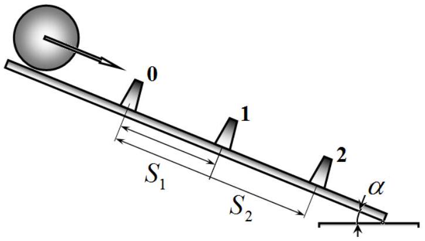
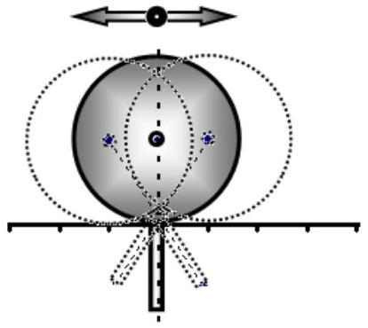

## February 17, 2022

## Please read this first:

1. The duration of the experimental competition is 4 hours. There are two problems.
2. You can use your own calculator for numerical calculations.
3. You are provided with Writing sheet and additional white sheets of paper. You can use the additional sheets of paper for drafts of your solutions, but these sheets will not be graded. Your final solutions should be written on the Writing sheets. Please use as little text as possible. You should mostly use equations, numbers, figures, and plots.
4. Use only the front side of Writing sheets. Write only inside the boxed areas.
5. Start putting down your solution to each problem on a new Writing sheet.
6. Graphs must be drawn on Writing sheets with the graph paper. All drawings must be done with a pen, not a pencil!
7. Fill in the boxes at the top of each Writing sheet with your country (Country), your student code (Student Code), problem number (Question Number), the progressive number of each Writing sheet (Page Number), and the total number of Writing sheets used (Total Number of Pages). If you use some blank Writing sheets for notes that you do not wish to be graded, put a large X across the entire sheet and do not include it in your numbering.

## Dry friction Experiment 1: Sliding friction

To measure the coefficient of sliding friction, the rolling of a solid homogeneous cylinder on an inclined plane is studied at various angles of inclination of the plane to the horizon. We assume that the force of sliding friction is described by the well-known Coulomb-Amonton law:

$$
F=\mu_{s} N,
$$

where $N$ stands for the normal reaction force and $\mu_{s}$ denotes the coefficient of sliding friction.
Consider the experimental setup to be a wide flat steel plate, whose angle of inclination to the horizon can be arbitrarily varied. The error in setting the angle of inclination of the plane to the horizon is $\Delta \alpha=0.2^{\circ}$.

The solid homogeneous steel cylinder can roll down the plate with its axis remaining horizontal all the time. To measure the acceleration, three optical sensors (0, 1, 2) are fixed on the plate. Each sensor consists of a light source and a photodetector, which are mounted on the identical stands. The

solid homogeneous cylinder is placed on the plate and released. The cylinder moves down between these stands and blocks the light beam so that at the moment of light interruption, an electrical impulse is generated that controls an electronic stopwatch (not shown in the figure). When the cylinder passes sensor 0, a stopwatch is started, when the cylinder passes sensors 1 and 2, the times of these passages are recorded.

Thus, the following time intervals are measured in the experiment:
$t_{1}$ - cylinder motion time interval from sensor 0 to sensor 1;
$t_{2}$ - cylinder motion time interval from sensor 0 to sensor 2.
These time intervals are recorded with 4 significant digits. The instrumental error in measuring time intervals $t_{1}$ and $t_{2}$ is equal $\Delta t=2 \cdot 10^{-4} \mathrm{~s}$.

The distances between the sensors are measured as:
from sensor 0 to sensor $1 S_{1}=(50.0 \pm 0.2) s m$;
from sensor 0 to sensor $2 S_{2}=(100.0 \pm 0.2) s m$.
When making numerical calculations, assume that the free fall acceleration is equal $g=9.81 m / s^{2}$.
The results of measuring time intervals $t_{1}$ and $t_{2}$ are given in Table 1 for different angles of inclination of the plate to the horizon.

Table 1. Time intervals of the cylinder motion.
| $\alpha^{\circ}$ | $t_{1}, s$ | $t_{2}, s$ |
| :--- | :--- | :--- |
| 20 | 0,4546 | 0,7187 |
| 25 | 0,3936 | 0,6290 |
| 30 | 0,3462 | 0,5589 |
| 35 | 0,3229 | 0,5211 |
| 40 | 0,3358 | 0,5283 |
| 45 | 0,3084 | 0,4911 |
| 50 | 0,2682 | 0,4347 |
| 55 | 0,2816 | 0,4432 |
| 60 | 0,2600 | 0,4113 |
| 65 | 0,2461 | 0,3908 |
| 70 | 0,2308 | 0,3675 |
| 75 | 0,2218 | 0,3542 |

## Theoretical part

1.1 Derive formulas for the acceleration of the cylinder axis in two cases: A) the motion of the cylinder occurs without slipping - acceleration $a_{1}$; B) when moving along the plate, the cylinder slips - acceleration $a_{2}$. Express your answers in terms of $\alpha, g, \mu_{s}$.
1.2 Express the maximum angle $\alpha=\alpha_{c r}$ of inclination of the plate, at which the motion of the cylinder still occurs without slipping, in terms of the coefficient of friction $\mu_{s}$.

## Processing of measurement data

1.3 Using the measurement results given in Table 1, calculate the acceleration with which the cylinder axis moved for each angle of inclination of the plate. Put down the formula for the acceleration, according to which the calculations are carried out. Draw a graph of the acceleration versus the angle and with its aid find an approximate value of the critical $\alpha_{\text {cr }}$.
1.4 Carry out the linearization of the obtained dependence, i.e. find such values $X(\alpha, a)$ and $Y(\alpha, a)$ so that the dependence $Y(X)$ turns linear for the both cases when the cylinder moves without slipping and with slipping. Draw a linearized dependence $Y(X)$ for all experimental points.
1.5 Using the linearized relationship $Y(X)$, calculate the coefficient of friction $\mu_{s}$ between the cylinder and the plate. Estimate the error $\Delta \mu_{s}$ of the obtained value. Put down the formulas used in your calculations.
1.6 Using the linearized relationship $Y(X)$, calculate the value of the critical angle $\alpha_{c r}$, at which the cylinder starts to slip. Estimate the error of the obtained value. Put down the formulas used in your calculations.

## Experiment 2: Rolling friction

In reality, even in the absence of slipping between the bodies, there are frictional forces called rolling friction forces. In this experiment, the following setup is used to study the rolling friction. A small rod is rigidly attached to the side surface of a massive solid cylinder, whose imaginary prolongation crosses the axis of the cylinder. The cylinder is located on the two horizontal plates so that it can roll over them without slipping. In this case, the rod lies always in the gap between the plates.

Let us use the following notation: the radius of the cylinder $R$, the mass of the cylinder $M$, the mass of the attached rod $m$, which can be considered significantly less than the mass of the cylinder, the distance from the center of mass of the rod to the axis of the cylinder $l$.

Usually, the formula for the rolling friction force is written as

$$
F=\frac{\kappa}{R} N,
$$

where $N$ is the normal reaction force, $R$ stands for the radius of the rolling body, and $\kappa$ refers to the rolling friction coefficient. In this part of the problem, it is necessary to determine the dimensionless value $\mu_{r}=\frac{\kappa}{R}$, which for brevity is called the coefficient of rolling friction. Typically, the coefficient of rolling friction is much less in magnitude than the coefficient of sliding friction studied above.

During the experiment, the cylinder is placed into its initial position in such a way that the rod is directed vertically upwards, after which the cylinder is released without any significant push. The cylinder starts to roll on the plates, performing damped oscillations due to the action of the rolling friction force. In this case, the coordinates of successive extreme positions of the cylinder (stoppage points) are written down: $x_{0}$ - initial position, $x_{1}, x_{2}, x_{3} \ldots-$ coordinates of successive stoppage points. The origin of coordinates $x=0$ corresponds to the point where the rod is directed vertically downwards. Table 2 shows the experimental values of the coordinates of the stoppage points, whose measurement error is found as $\Delta x=0,2 s m$.

Table 2. Coordinates of the stoppage points.
| $k$ | $x_{k}, \mathrm{sm}$ |
| :--- | :--- |
| 0 | 15,8 |
| 1 | -11,6 |
| 2 | 10,1 |
| 3 | -9,0 |
| 4 | 7,7 |
| 5 | -7,0 |
| 6 | 5,7 |
| 7 | -5,3 |
| 8 | 4,7 |
| 9 | -3,9 |
| 10 | 2,8 |

To determine the setup parameters, the period of small oscillations of the cylinder near the equilibrium position (point $x=0$ ) is measured. For this, the times of five oscillations of the cylinder with the rod are measured several times. The results of these measurements are shown in Table 3. The instrumental error of the time measurement is $\Delta t=0,02 s$

Table 3. The times of five oscillations

Table 3. The times of five oscillations
| $k$ | $t_{5}, s$ |
| :--- | :--- |
| 1 | 7,39 |
| 2 | 7,21 |
| 3 | 7,26 |
| 4 | 7,47 |
| 5 | 7,44 |

## Theoretical part

2.1 Derive the formula for the period of the small fluctuations described right above. Express the oscillation period in terms of the setup parameters $M, m, R, l$ and the free fall acceleration $g$.
2.2 Derive an equation relating the coordinates of two successive cylinder stoppage points $x_{k}, x_{k-1}$ in the described cylinder rolling experiment. This equation, in addition to the coordinates, may include the setup parameters $M, m, R, l$, the free fall acceleration $g$ and the coefficient of rolling friction $\mu_{r}$.
2.3 Express the coordinate of the $k$ 'th cylinder stoppage point in terms of the initial coordinate $x_{0}$ and the coordinates of all previous stoppage points $x_{1}, x_{2}, \ldots x_{k-1}$. This equation, in addition to the coordinates of the stoppage points, should include only the free fall acceleration $g$ and the period of small oscillations $T$.

## Processing of measurement data

2.4 Using the measurement results given in Table 3, calculate the period $T$ of small oscillations of the cylinder. Estimate the measurement error $\Delta T$ of this quantity.
2.5 Propose such values $Y\left(x_{k}\right)$ and $X\left(x_{0}, x_{1}, \ldots x_{k}\right)$ such that the dependence $Y(X)$ turns linear and allows you to calculate the coefficient of rolling friction $\mu_{r}$. Draw a graph of the linearized relationship $Y(X)$.
2.6 Using the linearized relationship $Y(X)$, calculate the coefficient of rolling friction $\mu_{r}$. Estimate the error $\Delta \mu_{r}$ of the obtained value.
