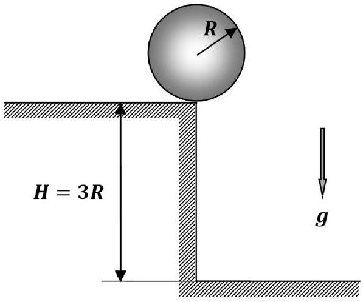
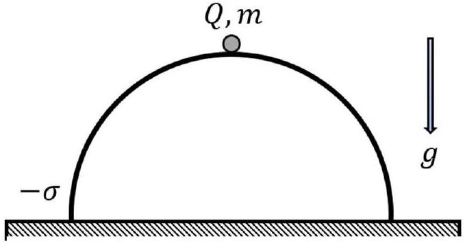

## Problem 1 (10.0 points)

This problem consists of three independent parts.

## Problem 1.1 (4.0 points)

A ball of radius $R$ rests on the edge of a horizontal table of height $h=3 R$. The ball starts to fall without a significant initial push, and there is no slipping with the edge during the entire time of motion. Find at what distance $l$ from the base of the table the ball first touches the floor. The free fall acceleration is equal to $g$, air resistance is negligible. It is known that the kinetic energy of a ball rolling without slipping is equal to $E=$ $\frac{7}{10} m v^{2}$, where $v$ denotes the speed of the ball center with $m$ being its mass.

Problem 1.2 (3.0 points)

A quasi-static process is carried out with one mole of an ideal monatomic gas, as a result of which its initial volume $V_{0}=1 m^{3}$ increases four times, and the initial pressure $p_{0}=10^{5} \mathrm{~Pa}$ decreases two times. It is known that for each small section of the quasi-static process, the ratio of work to the change in internal energy is a constant value. Find the total work $A$ done by the gas in this process.

## Problem 1.3 (3.0 points)

A thin-walled dielectric hemisphere, negatively charged with the surface density $-\sigma$, is placed on the horizontal table. A point-like ball of mass $m$ is carefully placed on its top. Determine the minimum positive charge $Q$ of the ball, such that it is still in a state of stable equilibrium at the top of the hemisphere. The charges between the hemisphere and the ball are not redistributed. The free fall acceleration is $g$.

