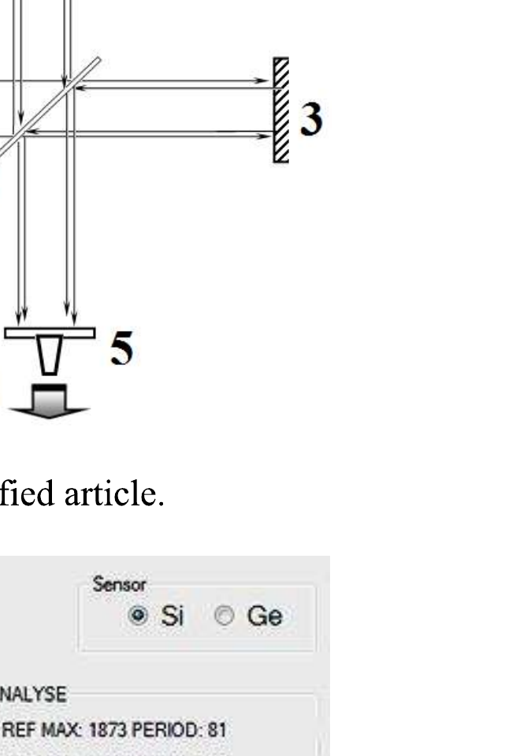
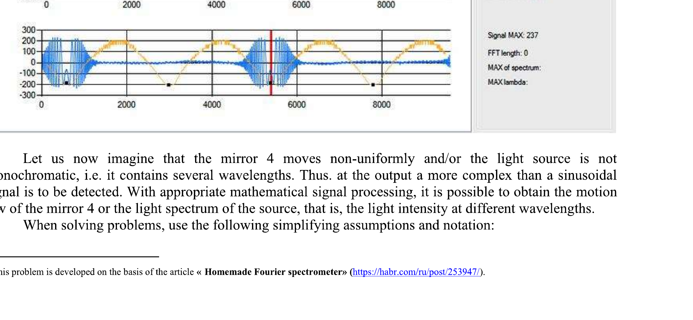

February 3, 2023

## Please read this first:

1. The duration of the experimental competition is 4 hours. There is one problem.
2. You can use your own calculator for numerical calculations.
3. You are provided with white sheets of paper for drafts of your solutions, but these sheets will not be graded. Your final solutions must only be written on the Writing sheets. You can write very short explanations using equations, numbers, letters.
4. Use only the front side of Writing sheets. Write only inside the boxed areas.
5. Graphs must be drawn on Writing sheets within the graph paper area. All drawings must be done with a pen, not a pencil! If you need additional Writing sheets with the graph paper, you can find them at the end of your worksheet.
6. Fill in the boxes at the top of each Writing sheet with your country (Country), your student code (Student Code), problem number (Question Number), the progressive number of each Writing sheet (Page Number), and the total number of Writing sheets used (Total Number of Pages). If you use some blank Writing sheets that you do not wish to be graded, put a large X across the entire sheet and do not include it in your numbering.

## Fourier spectrometer ${ }^{\mathbf{1}}$ Introduction

The main element of the Fourier spectrometer is the Michelson interferometer.
Assume that we have a coherent light source with a certain wavelength. When the difference in the path of the two beams that come to a receiver is a multiple of half the wavelength, that is, the beams come in antiphase, the intensity of the detected intensity is close to zero. When one of the mirrors of the interferometer is moved, the difference in the path of the light rays changes, so the light intensity recorded by the receiver also varies. It is known that the intensity is to be maximum when the path difference is a multiple of the wavelength.

If one of the mirrors of the interferometer moves at a constant speed, then a sinusoidal signal is to be observed at the output of the receiver. The amplitude of the sinusoid is proportional to the light intensity, and its period depends on the wavelength.

The figure shows a setup of the Michelson interferometer. The light flux from source 1 is formed by lenses into a parallel beam of rays and directed to beam splitter 2. Part of the light (half in intensity) passes through the plate to hit the fixed mirror 3 and is completely reflected from it, and then hits the plate 2 again to be reflected from it and hit the screen with the photodetector 5 . The second half of the light flux from the source is reflected from the beam-splitting plate 2 to hit the movable mirror 4, it is then reflected to pass through the plate 2 and hit the screen with the photodetector 5. Thus, two coherent waves reflected from the mirrors 3 and 4 fall on the screen. These waves interfere with each other, and the receiver registers the resulting light intensity on the screen as a function of time. This function is written to the computer's memory for further

processing.

For illustration, we present a photograph of the registered signal from the specified article.

Let us now imagine that the mirror 4 moves non-uniformly and/or the light source is not monochromatic, i.e. it contains several wavelengths. Thus. at the output a more complex than a sinusoidal signal is to be detected. With appropriate mathematical signal processing, it is possible to obtain the motion law of the mirror 4 or the light spectrum of the source, that is, the light intensity at different wavelengths.

When solving problems, use the following simplifying assumptions and notation:

[^0]1) the voltage recorded by the photodetector is proportional to the light intensity, the sensitivity of the photodetector does not depend on the light wavelength; using an electronic circuit, the constant component of the signal is cut off, so only the variable component is reflected on the graphs;
2) the movable mirror oscillates according to a harmonic law $x(t)$ with a frequency of 20 Hz and a constant amplitude; it is assumed that at $x=0$, the path difference of the interfering waves is equal to zero;
3) the intensities of the interfering waves at the receiver are equal;
4) the beginning of the signal registration is coordinated with the motion of the movable mirror and always starts at the same position of the mirror;
5) signal registration is carried out at equidistant moments of time and recorded in memory cells, which are further numbered with integer values $t$. In fact, the registration time $t$ is recorded in relative units.
6) all the figures in the problem show graphs of the dependences of the recorded voltage on the number of the memory cell. To simplify the solution, each graph is accompanied by a table, which indicates the positions of the extrema (maxima and minima) of the registered signal $t_{m}$, the extrema themselves are numbered with the letter $m$.

Attention! On separate Writing sheets, the registered signals are given in the form of the dependence of the photodetector voltage on the time, which you are assumed to process. Note that only a part of all signals are given. When solving this problem, you do not need to use all the given numerical data. Use only those that you consider necessary to calculate the required values. When plotting, use a reasonable amount of data (10-15 points), but remember that the accuracy of the calculations increases when the number of data used grows. Be sure to indicate in the solution, which data you use, and be sure to include the formulas used for calculations. For calculations, you must use the prepared tables in the Writing sheets. To draw graphs, use the forms given in the same Writing sheets. Please note that only Writing sheets are to be graded. For draft notes, you can use white sheets of paper, but they will not be graded!

## Problems

## 1. Theoretical part

The interferometer is illuminated by the monochromatic radiation with the wavelength $\lambda$.

1. Let us denote $I_{0}$ as the intensity of each of the interfering waves, and the phase shift between the waves as $\Delta \varphi$. Write down the formula for the intensity $I$ of the resulting wave.
1.2 Write down the formula for the intensity $I(x)$ of the wave at the receiver as a function of the position of the movable mirror $x$.
1.3 Write down formulas indicating at what values $x_{m}$ of the mirror position the light intensity on the screen is to be maximum or, correspondingly, minimum.
1.4 Write down the general formula that determines the mirror coordinate $x_{m}$, at which the light intensity on the screen is extreme.

## 2. Monochromatic radiation of a known wavelength as an instrument calibration

Figure 1 shows the dependence of the light intensity on the time when the interferometer is illuminated with monochromatic radiation with the wavelength $\lambda_{0}=0.640 \mu \mathrm{~m}$. Table 1 shows the times $t_{m}$ at which the light intensity is extreme (maxima and minima), as well as the signal values $U_{m}$ at corresponding time moments.
2.1 Determine the division value $\Delta t=1$ of the device in milliseconds.

In the following, all calculations must only be carried out in the units of the instrument scale.
2.2 On the basis of the given experimental data, show that the motion of the mirror can be described by the function

$$
x(t)=A \sin \left(\frac{2 \pi}{T}\left(t-t_{0}\right)\right)
$$

Find the values of the parameters of this function: period $T$ in units of the instrument scale; oscillation amplitude $A$ in micrometers; point in time $t_{0}$ at which $x=0$. Plot a linearized graph of dependence (1),
proving the applicability of the above formula to describe the oscillations of the mirror. Estimate the error $\Delta A$ in determining the amplitude of oscillations.

Function (1) with the found values of the parameters should be used when performing the following parts of the problem.

## 3. Monochromatic radiation with unknown wavelength

The interferometer is illuminated by a monochromatic radiation with an unknown wavelength that you have to determine.

Figure 2 shows the dependence of the light intensity on the time for this case. Table 2 shows the values of the extrema coordinates for this particular case.
3.1 Plot the dependence of the mirror coordinates $x_{m}$, at which the intensity is extreme, as a function of the number of the extremum .
3.2 Using the plotted graph, determine with maximum accuracy the value of the wavelength $\lambda$ of the light source. Estimate the error $\Delta \lambda$ of the obtained value.

## 4. Two monochromatic waves

The interferometer is illuminated by radiation containing two monochromatic waves. The wavelength of one of them is $\lambda_{1}=0.640 \mu \mathrm{~m}$, and the wavelength $\lambda_{2}$ of the second is unknown.

Figure 3 shows the dependence of the light intensity on the screen as a function of the time. Table 3 shows the values of the extrema for this particular case.
4.1 Using the given data, determine with maximum accuracy the wavelength $\lambda_{2}$ of the second spectral component. Estimate the error $\Delta \lambda_{2}$ of the found value of the wavelength.
4.2 Determine the ratio of the intensities of the second and first waves $I_{2} / I_{1}$.

[^0]:    ${ }^{1}$ This problem is developed on the basis of the article «Homemade Fourier spectrometer» (https://habr.com/ru/post/253947/).
