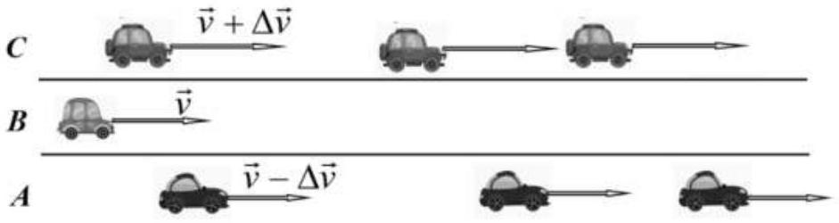
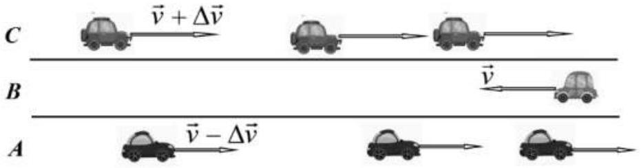
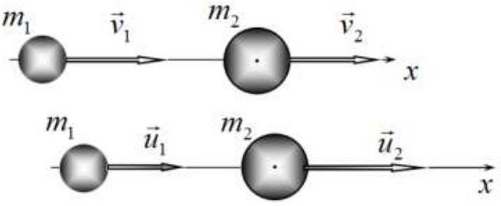
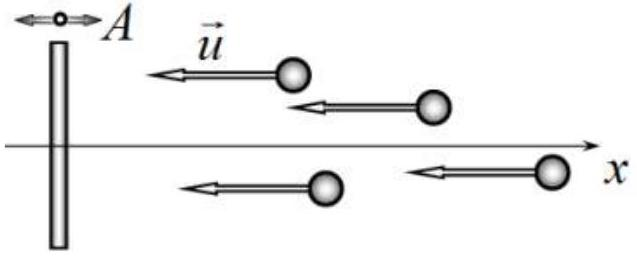
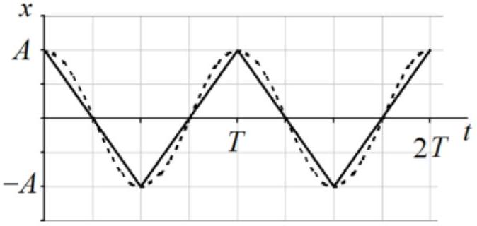

## Problem 2. Fermi acceleration (10.0 points)

Cosmic rays contain extremely high energy particles. A possible mechanism for the appearance of such particles is called Fermi acceleration.

Fermi acceleration is a stochastical mechanism for the acceleration that charged particles experience when they are repeatedly reflected, usually by magnetic mirrors. In this problem, we consider the main ideas underlying this paradoxical, at first glance, phenomenon.

## Why are there more oncoming cars than overtaking cars?

On a motorway with three lanes $\boldsymbol{A}, \boldsymbol{B}, \boldsymbol{C}$, cars move at a constant speed in one direction: along the central lane $\boldsymbol{B}$, a car moves at a speed of $v=90 \mathrm{~km} / \mathrm{h}$; cars move along lane $\boldsymbol{A}$ at speeds $v-\Delta v=80 \mathrm{~km} / \mathrm{h}$; cars move along lane $\boldsymbol{C}$ at speeds $v+\Delta v==100 \mathrm{~km} / \mathrm{h}$. The distance between cars is the same on each of lanes $\boldsymbol{A}$ and C , the number of cars per unit of lane length for each of them is $n=5.0 \mathrm{~km}^{-1}$.

Consider the car moving in lane $\boldsymbol{B}$.
2.1 Calculate how many cars $N_{1}$ in lane $\boldsymbol{A}$ overtake the car $\boldsymbol{B}$ within the time period of $t=1.0 \mathrm{~min}$, as well as the time $\tau_{1}$ between two consecutive overtakes.
2.2 Calculate how many cars $N_{2}$ in lane $\boldsymbol{C}$ overtake the car in lane $\boldsymbol{B}$ within the time period of $t=1.0 \mathrm{~min}$, as well as the time $\tau_{2}$ between two consecutive overtakes.

Now let the car move in lane $\boldsymbol{B}$ towards the cars moving in lanes $\boldsymbol{A}$ and $\boldsymbol{C}$. The speeds of all cars and their density on each lane remain the same.

2.3 Calculate the number of cars $N_{3}$ in lane $\boldsymbol{A}$ and $N_{4}$ in lane $\boldsymbol{C}$ that the car $\boldsymbol{B}$ encounters within the time period of $t=1.0 \mathrm{~min}$, as well as the corresponding times $\tau_{3}$ and $\tau_{4}$ between two consecutive encounters.

## Elastic collision

In this part, we consider the classical problem of elastic collision of two bodies. The main purpose of this consideration is to determine the conditions under which the kinetic energy of one of the selected bodies increases as a result of the collision.

Two elastic balls, whose masses are equal to $m_{1}$ and $m_{2}$, respectively, move along the axis $x$. The speed of the first ball before the collision is $v_{1}$, whereas the speed of the second is $v_{2}$. Let us denote the speeds of the balls after an absolutely elastic central collision as $u_{1}$ and $u_{2}$, respectively. The speeds of the balls should be understood as the projections of their velocities on the $x$

axis, therefore, they can be both positive and/or negative.
2.4 Express the velocities of the balls $u_{1}$ and $u_{2}$ after the collision in terms of their velocities before the collision $v_{1}$ and $v_{2}$, as well as their masses.

Let us denote the ratio of the ball masses as $\mu=\frac{m_{2}}{m_{1}}$, the ratio of the speeds of the first ball after and before the collision as $\eta_{1}=\frac{u_{1}}{v_{1}}$ and the ratio of the velocities of the balls before the collision as $\eta_{2}=\frac{v_{2}}{v_{1}}$. For definiteness, consider that $v_{1}>0$.
2.5 Draw a set of graphs that represents the dependence of the parameter $\eta_{1}$ on the parameter $\eta_{2}$ for all characteristic values of the ball mass ratios $\mu$.
2.6 Find the relation between the parameters $\eta_{2}$ and $\mu$, at which the first ball increases its energy as a result of the collision.
2.7 Consider the case of a light ball colliding with a heavy one such that $m_{2} \gg m_{1}$. In this limiting case, find the speed of the first ball $\tilde{u}_{1}$ after the collision and determine the range of velocities $\eta_{2}$ of the heavy ball before the collision, at which the energy of the light ball increases as a result of the collision.

## The simplest Fermi acceleration model

A massive plate, located perpendicular to the $x$ axis, performs harmonic oscillations in the direction of the $x$ axis. The oscillation amplitude is $A$ with the period being $T$. Light balls move with equal speeds $u$ in the direction of the plate along the $x$ axis such that the times of ball arrivals to the still plate are

randomly and uniformly distributed.
2.8 Express the maximum speed of the plate $V_{0}$ in terms of the amplitude and period of its oscillations.
2.9 Calculate the fraction $\varphi$ of incident balls that are to increase their kinetic energy after the collision. Express your answer in terms of $u$ and $V_{0}$. For a numerical estimate, consider the following two cases separately: a) $u=1.5 V_{0}$; b) $u=0.50 V_{0}$.

Let us approximate the harmonic law of the plate motion by a piecewise linear function, see the figure below, i.e. assume that the modulus of the plate speed remains constant at the same values of the amplitude and period of oscillations.

2.10 Express the value of the plate speed modulus $V$ in terms of the amplitude and period of its oscillations.
2.11 Calculate how many times $\varepsilon=\frac{E}{E_{0}}$ the average energy of the incident balls changes, where $E_{0}$ is the kinetic energy of the balls before the collision, and $E$ symbolizes the average energy of the balls after the collision with the oscillating plate. For a numerical estimate, consider the following two cases separately: a) $u=1.5 \mathrm{~V}$; b) $u=0.50 V$.
