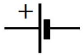
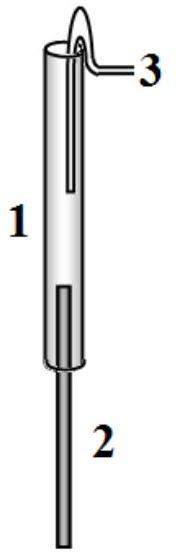
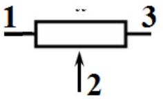
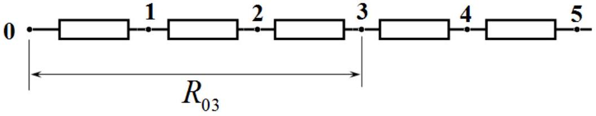
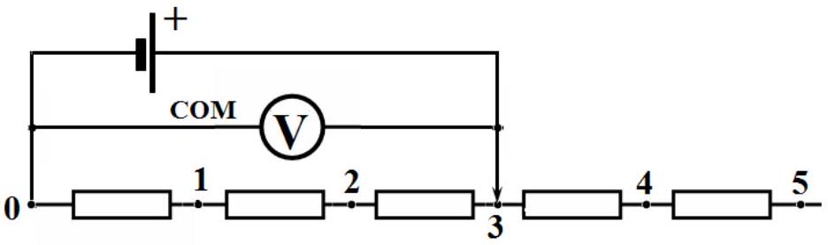
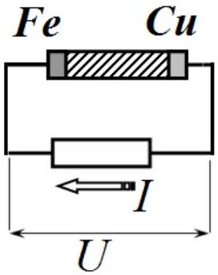
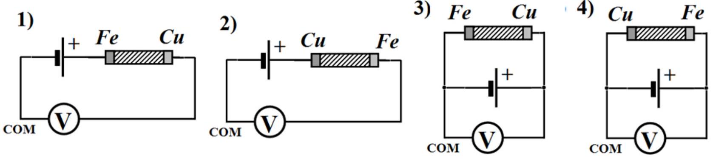
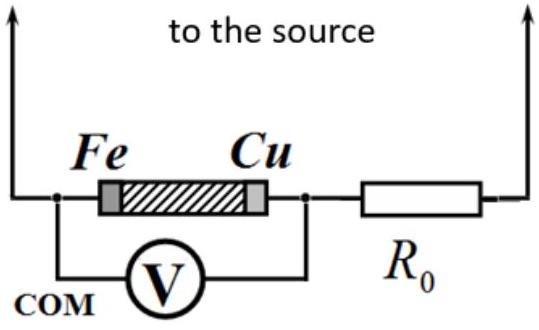
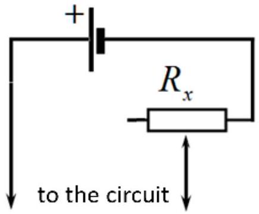
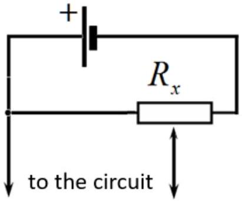

## EXPERIMENTAL COMPETITION

January 15, 2025

## Please read the instructions first:

1. The Experimental competition consists of one problem. This part of the competition lasts 3 hours.
2. Please only use the pen that is provided to you.
3. You can use your own non-programmable calculator for numerical calculations. If you don't have one, please ask for it from Olympiad organizers.
4. You are provided with Writing sheet and additional papers. You can use the additional paper for drafts of your solutions but these papers will not be checked. Your final solutions which will be evaluated should be on the Writing sheets. Please use as little text as possible. You should mostly use equations, numbers, figures and plots.
5. Use only the front side of Writing sheets. Write only inside the bordered area.
6. Fill the boxes at the top of each sheet of paper with your country (Country), your student code (Student Code), the question number (Question Number), the progressive number of each sheet (Page Number), and the total number of Writing sheets (Total Number of Pages). If you use some blank Writing sheets for notes that you do not wish to be evaluated, put a large X across the entire sheet and do not include it in your numbering.
7. At the end of the exam, arrange all sheets for each problem in the following order:
    - Used Writing sheets in order.
    - The sheets you do not wish to be evaluated.
    - Unused sheets.
    - The printed problems.

Place the papers inside the envelope and leave everything on your desk. You are not allowed to take any paper or equipment out of the room.

## Galvanic cells

In this experiment you have to investigate the characteristics of two galvanic cells: industrial and homemade.

Equipment.

1. Galvanic element "Camelion" 1.5 V. Wire leads are soldered to the element. In circuits it is designated traditionally.

2. Homemade galvanic element. Consists of a plastic tube 1 , at the bottom there is an iron rod 2, which is the first electrode. The rod also serves as a holder. The lower end of the rod is fixed to the cover-stand with a piece of plasticine (not shown in the figure). A piece of copper wire 3 is placed in the upper part of the tube, which serves as the second electrode. The tube is filled with a solution of citric acid. Using a syringe, you can add and change the solution if necessary.
Fe Cu In circuits, this element is designated as follows. The positive pole is the copper electrode.

Attention.

- after replacing (or even adding) the solution, the element must be left to stay for at least 5 minutes;

- the element must be in a vertical position at all times;
- connect the wires to the element electrodes and try not to touch them during measurements; this is especially true for the upper copper electrode: its slight displacement changes the readings, connect only one wire to it.

3. Multimeter. You can use the multimeter to measure the resistance of the resistors in the ohmmeter mode. When taking measurements in circuits with galvanic elements, use the multimeter only in the voltage measurement mode. The voltmeter shows a positive voltage value when the negative electrode is connected to the "Com" terminal. Additional instructions for using the multimeter are provided separately.
4. Variable resistor 20 kOhm (potentiometer). The figure shows the potentiometer terminals. The arrangement of the device terminals corresponds to that shown in the figure.

5. A chain of 5 constant resistors, each with a resistance of approximately 1 Ohm (You will have to measure the exact resistance values by yourself).
6. Constant resistor with a resistance of 10 kOhm.
7. Connecting wires.

Attention.

- The ends of the wires are stripped for connecting them together using the "twisting" method;
- Two wires are equipped with crocodile connectors, use them in places where switching is required during measurements;
- Keep in mind: electrical engineering is the science of contacts, so carefully make the connections of all wires;
- Do not skimp on the time to assemble electrical circuits: all elements should be on the table, not suspended; try not to move them during measurements (this can disrupt the connections); connect the leads of the multimeter (probes) to the elements of the circuit, and do not hold them in your hands, for the contact that you will need to switch during measurements, use a crocodile clamp.

8. A glass with citric acid solution. A glass for used solution. A syringe for filling the tube of a homemade galvanic element. Napkins. Do not remove the nail from the tube. When replacing the solution, "shake" the liquid out of the tube into the glass. Keep your work area clean by using napkins.
9. Stopwatch.

Part 1. Characteristics of the galvanic cell "Camelion".

1.1 Using a multimeter in ohmmeter mode, measure the resistance of the resistor chain: when connected to contacts "0" and in series "1", "2"... "5" (these resistances are designated as $\left.R_{01}, R_{02}, R_{03}, \ldots\right)$.

Use the circuit shown in the figure on the right.
Attention! Connect the source only for the duration of the measurement. Perform measurements quickly, do not let the resistors heat up!

1.2 Measure the dependence of the voltage $U_{k}$ on the external circuit on the number of the connection point of the galvanic element $k=1,2, \ldots$
1.3 Provide a formula that allows you to calculate the current in the circuit $I_{k}$ based on the results of the measurements. Calculate the values of $I_{k}$. Plot a graph of the dependence of the voltage on the external circuit on the current $U(I)$.
1.4 Write down the formula for the theoretical dependence $U(I)$. Using the obtained experimental data, calculate the values of the EMF $\varepsilon$ and the internal resistance of the galvanic cell. Estimate the error of the values found.

## Part 2. Homemade galvanic cell.

In this part of the experiment you need to conduct similar research for a homemade galvanic cell.

2.1 Suggest an electrical circuit that allows you to measure the dependence of the voltage on the external circuit on the current in the circuit $U(I)$. Specify all elements you use when taking measurements. Specify which quantities you measure. Provide the calculation formulas you use.

Attention.

- use the multimeter only in voltage measurement mode;

- during measurements, you may need to regularly change some connection points: try to have as few such switches as possible;
- connect only one wire to the copper electrode of the element, do not touch it during measurements;
- for switching, be sure to use wires with crocodile connectors;
- during measurements, wait for the multimeter to develop constant readings, this may take several tens of seconds (you can use a stopwatch to control the time).

2.2 Measure the dependence of the voltage on the external circuit on the current in the circuit $U(I)$. Plot a graph of the obtained dependence.
2.3 Using the obtained data, calculate the EMF $\varepsilon$ and the internal resistance of the homemade galvanic element. Estimate the error of the values found.

Part 3. Connections of galvanic cells.
The figure below shows possible connections of two galvanic cells.

3.1 Measure the total EMF for four types of connections of two elements.
3.2 Calculate the theoretical values of the total EMF for four types of galvanic cell connections.

Part 4. Current-voltage characteristic of a galvanic cell.
Calculation of errors in this part is not required.
In this part, it is necessary to investigate the characteristics of a homemade galvanic cell when an electric current is generated by an external source.

You have to obtain the dependence of the voltage on the galvanic element on the current strength. To do this, use the circuit on the right. Use the resistor $R_{0}=10 \mathrm{k} 0 \mathrm{hm}$ to measure the current through the galvanic element.

Use two adjustable source circuits. Start measurements with the maximum current value by module, gradually and monotonously decreasing it using a variable resistor. Do not rush, wait for the multimeter readings to settle at each measurement.

First, take measurements with the source, using the variable resistor circuit on the right. Take measurements with two polarities of the source connection (the " Camelion " element).

4.1 Measure the dependence of the voltage on the galvanic cell on the strength of the current flowing through it. Plot a graph of the obtained dependence.
4.2 On the obtained dependence, select the linear sections. Draw smoothing lines, find the parameters of these lines. For each selected linear section, indicate the values of EMF and internal resistance of the homemade galvanic element.

Now perform similar measurements with the source according to the potentiometer circuit on the right. Perform measurements with two polarities of the source connection (the " Camelion " element).

4.3 Measure the dependence of the voltage on the galvanic element on the strength of the current flowing through it. Plot a graph of the obtained dependence.
4.4 On the obtained dependence, select the linear sections. Draw smoothing lines, find the parameters of these lines. For each selected linear section, indicate the values of EMF and internal resistance of the homemade galvanic element.
