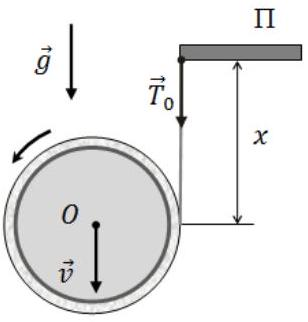
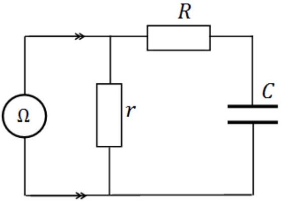
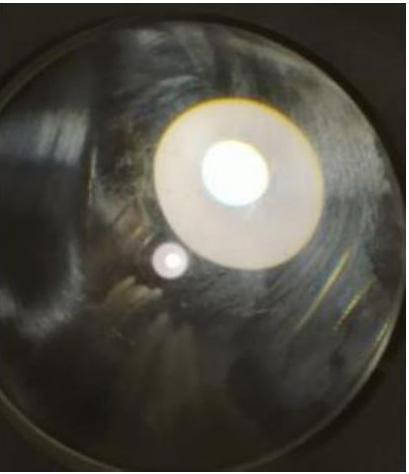

Problem 1 (10.0 points)
This problem consists of three independent parts.
Problem 1.1 (3.0 points)
A thin cylindrical core of radius $R$ has a strip of foil tightly wound around it in a thin layer. The foil has thickness $\delta$, mass $m$, and length $L=10.0 \mathrm{~m}$. One end of the foil is fixed to the core, while the other end is attached to the edge of a thin horizontal platform $\Pi$. Initially, the roll (the core with the wound foil) is held so that its axis $O$ is horizontal and at the same level as the platform. The roll is then released, and under the action of gravity it begins to unwind. Assuming that $\delta \ll R \ll L$, find the length $x_{0}$ of the unwound part of the foil for which the force $T_{0}$ acting on the platform is equal to

the weight of the roll, $m g$. Also determine the acceleration $a$ and the velocity $v$ of the downward motion of the roll's center of mass at that instant.

Problem 1.2 (4.0 points)
The readings of a multimeter ( $\Omega$ ) operating in ohmmeter mode and connected to a circuit change with time according to the law $R_{\Omega}(t)=$ $A-B e^{-t / \tau_{0}}$, where $A=100 \mathrm{k} \Omega, B=40 \mathrm{k} \Omega$, and $\tau_{0}=100 \mathrm{~s}$. Using these data, determine the values of the resistances $r$ and $R$, as well as the capacitance $C$ of the capacitor, which is initially uncharged. Also find the amount of heat $Q$ released in the resistor $R$ during the measurement time $t \gg \tau_{0}$.

Note: In ohmmeter mode, the multimeter measures the voltage drop $U_{x}$ across an unknown resistor $R_{x}$ when a constant current $I_{0}=0.1 \mathrm{~mA}$

flows through it. The instrument displays the value $R_{x}=U_{x} / I_{0}$.

Problem 1.3 (3.0 points)
An observer (the eye) is located at a distance $L=55 \mathrm{~cm}$ from a convexconcave lens and observes images of a distant street lamp formed due to reflections from both surfaces of the lens (see photo). The lamp and the eye are positioned close to the principal optical axis of the lens on the side of the concave surface. The radius of curvature of the concave surface is $r=7 \mathrm{~cm}$, and the radius of curvature of the convex surface is $R=28 \mathrm{~cm}$. Upon observation, two images of the lamp are visible: one real and the other virtual. The ratio of the apparent angular sizes of these images is $\gamma=\varphi_{1} / \varphi_{2}=0.1$, where $\varphi_{1}$ is the angular size of the real image and $\varphi_{2}$ is the angular size of the virtual image. Find the optical power $D$ of the lens.

