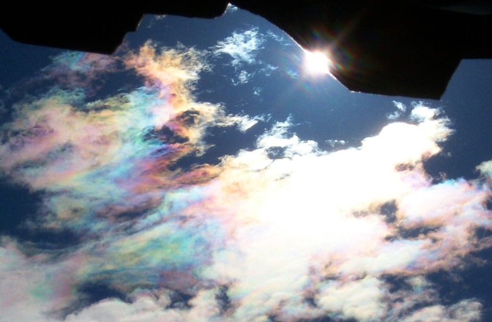

[2] Problem 24. Sometimes, a cloud will display a colorful pattern, as shown.

What is the explanation for this phenomenon, and why is it relatively rare? While you’re at it,
what’s going on with the sun in this photo?
