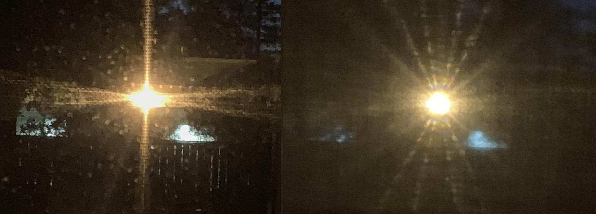

[3] Problem 25. A student noticed an odd pattern when the light from a streetlamp shined through
their open window. The window is fitted with a metal mesh screen and a curtain. Photos were
taken with the curtain up (left) and down (right).

For scale, the streetlamp was about 30m away, the distance between the metal wires was 1.4mm,
the diameter of each wire was 0.4mm, and the curtain was woven from fibers whose width was
comparable to that of a human hair.
(a) Explain everything you can about the pattern on the left.
(b) Explain everything you can about the pattern on the right.
(c) What, if anything, can we learn about the streetlamp from either picture?
