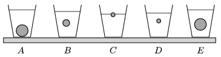

The same amount of water is poured into five alike glasses. One ball as well was placed into each glass. The radius of each ball is either 1 cm, 2 cm or 3.5 cm. Then the weight of each glass with the water and the ball in it was measured, and according to their weights they were placed into an increasing order. What is this order and why?

 (3 pont)

