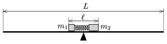

There are two small objects on an $L=3$ m-long wooden board, supported at its middle by a wedge. The masses of the objects are $m_1=0.2$ kg and $m_2=0.3$ kg. Between the objects there is a compressed small spring of negligible mass. The spring is compressed to a length of $\ell=0.3$ m, and tied with a thread. The wedge is exactly below the centre of mass of the system.

 The thread is burnt, and the spring launches the object with mass $m_1$ at a speed of $v_1=2$ m/s. To which direction and when will the board be tilted? (Friction is negligible.)
 (3 pont)

