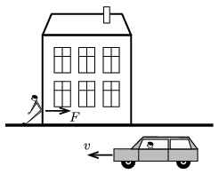

A man leans against the wall of a house in a peculiar way as shown in the figure, and exerts a force of $F$ onto the wall. If he is observed from the reference frame of the ground, the man does not perform work, because his displacement is zero. According to another observer who is travelling in a car, moving at a speed of $v$, the man exerts a constant force while moving a long distance, so he does work. Why doesn't the man leaning against the house get exhausted?

 (3 pont)

