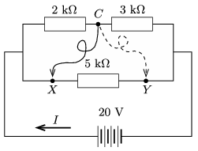

Point $C$ can be connected to either point $X$ or to point $Y$ by means of a piece of flexible wire as shown in the figure of the circuit.

 $a)$ What is the value of current $I$ in the main branch in each case?
 $b)$ What is the value of this current if the flexible wire is disconnected from point $C$?
 (3 pont)

