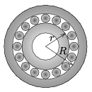

The inner ring of the ball-bearing shown in the figure is at rest, the centres of the balls are undergoing circular motion at a speed of 0.2 m/s. What is the number of revolution of the outer ring, if $r=3$ cm, $R=4$ cm?

 (3 pont)

