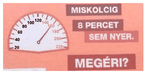

How far may the city Miskolc be from the road sign in which the following warning is written: ``You cannot even save 8 minutes till Miskolc. Is it worth it?'' (The speed limit for the highways in Hungary is 130 km/h.)

 (4 pont)

