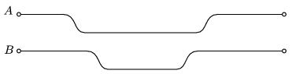

Two balls are started at the same initial speed, each rolls along a horizontal plane first. During the motions both balls roll down along a slope, and then they both roll up to the initial level of their motion, and then they got to the end of the paths. The lengths of both paths are the same, the depths of the paths are also the same. Friction is negligible in both cases.
 Which ball reaches the end of the path first?

 (3 pont)

