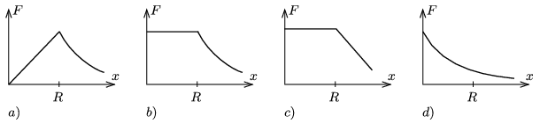

If the Earth was a uniform density sphere of radius $R$, which of the graphs shown below would be the correct sketch of the gravitational force as a function of the distance measured from the centre of the Earth?

 (3 pont)

