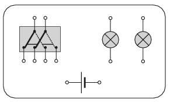

There are two filament lamps, a battery and a double switch in the figure. The switch changes two contacts at the same time when it is turned. Plan a circuit (that is, draw the wires) using the given components in which the two lamps are connected in series at one position of the switch, and when the switch is turned, then the lamps are connected in parallel.

 (3 pont)

