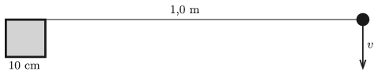

In this problem the motion of a small disc sliding along a horizontal frictionless surface of ice is investigated. A column, having a square-shaped cross section, emerges from the ice. The side of the square is 10 cm. The disc is attached to the column by means of a piece of 1.0 m long thread. The top view of the arrangement is shown in the figure. The disc is given an initial speed of $v=1.0$ m/s. How much time elapses until the disc hits the column?

 (3 pont)

