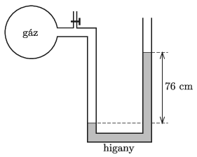

The pressure of a sample of gas in a container is measured by means of a U-shaped tube containing mercury, as shown in the figure.

 $a)$ Determine the absolute pressure of the gas in the container, provided that the difference of mercury levels in the two arms of the U-shaped tube is 76 cm and the ambient air pressure is 1 atm.
 $b)$ Then the gas is completely evacuated from the container by a pump attached to the tap shown in the figure. Determine the location of the mercury now.
 (3 pont)

