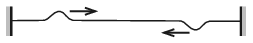

The two ends of a stretched elastic cord are jerked at the same instant, one end upward, whilst the other downward. Thus two pulses start to move towards each other as shown in the figure.

 The two symmetrical pulses carry the same amount of energy. When the two pulses meet the elastic cord becomes straight for a moment. Where is the energy of the two pulses? Will they pass each other or will they cancel each other?
 (4 pont)

