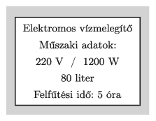

The data in the figure can be read on the label of an old boiler.

 $a)$ What is the efficiency of the boiler if during the warm-up time (5 hours) the boiler heats up water from a temperature of $15\;{}^\circ$C to $75\;{}^\circ$C?
 $b)$ Today this boiler is used at a voltage of 230 V. To what time did the warm-up time of the boiler decreased?
 (3 pont)

