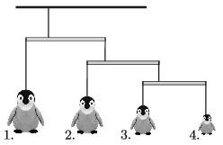

Toy penguins were suspended to an unsteady room decoration. The very light rods (see the figure ) were suspended at their quadrisection points such that the structure is in equilibrium. What are the masses of the second, the third, and the fourth toy penguins, if the first one has a mass of 480 g?

 (3 pont)

