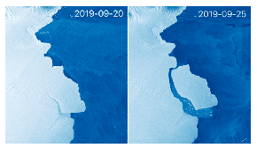

The 315 billion-tonne D28 iceberg (also known as Loose tooth, or Molar Berg) broke off Antarctica on 25 September 2019. If it was smashed to small ice-cubes and put into water at a temperature of $20\;{}^\circ$C, how many times of the amount of the water in lake Balaton could be cooled down to a temperature of $0\;{}^\circ$C? The volume of the water in lake Balaton is 1.9 km${}^3$. Suppose that the temperature of the ice-berg is $-10\;{}^\circ$C everywhere.

 (4 pont)

