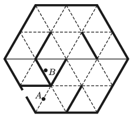

Ben ran into a mirrored labyrinth of an amusement park, and hid at point $B$. Can his mother, who is looking for Ben standing at point $A$, see him? The plan of the mirrored labyrinth of the amusement park is shown in the figure. The thick lines represent mirrors with reflexive surfaces at both of their sides.

 (4 pont)

