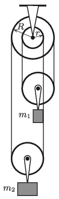

The pulley wheel shown in the figure can rotate freely about a fixed shaft. The masses of the movable pulleys are $m_1$ and $m_2$ ($m_1<m_2$). In what direction and at what magnitude of force do we have to pull the thread at the left in order to keep the system in equilibrium? (The thread does not slide on the pulley.)

 Data: $R=10$ cm, $r=5$ cm, $m_1=2$ kg, $m_2=3$ kg.
 (4 pont)

