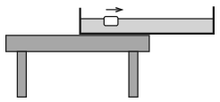

A big bowl full of water extends beyond the edge of the table so far, that it is just on the verge of tipping over. A piece of ice cube is floating in the water in that part of the bowl which is above the table. A very gentle breeze wafts it towards the part of the bowl which is not above the table. When will the bowl tip over?

 (3 pont)

