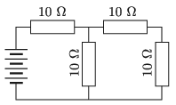

The circuit shown in the figure consists of four alike resistors each of resistance $10~\Omega$ and a battery.

 $a)$ What is the terminal voltage of the battery if the power dissipation at the resistor which dissipates the greatest thermal energy is 360 W?
 $b)$ What is the dissipated power at the other resistors?
 (4 pont)

