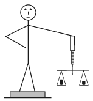

Jack, whose mass is 35 kg, stands on a bathroom scale. He holds a spring balance, which weighs 0.5 N, in his hand, and he hangs a traditional balance to the spring balance. The weight of the empty traditional balance is 15 N. In one plate of the traditional balance there is a stone, which is balanced by weights whose total mass is 2 kg and 20 dag. What is the reading on the bathroom scale?

 (3 pont)

