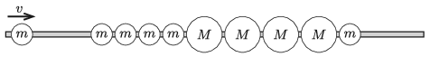

Four balls of mass $m$, then another four balls of $M$ and then one more ball of mass $m$ are strung on a horizontal, frictionless, fixed rod, as shown in the figure. The balls are close to each other, they are made of some perfectly elastic material and $m <M$. From the left another ball of mass $m$ is coming at a speed of $v$ and collides with the first one of the ball string.

 After the following collisions which balls remain at rest and what will the direction of the motion of the other balls be?
 (4 pont)

