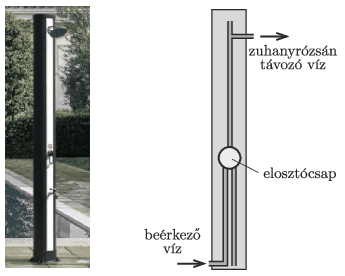

The photo on the left shows a garden solar shower. The incident sunlight heats up the water in the vertical black container. From the lower tap (the so-called leg wash) only cold water flows, while from the upper shower rose we can enjoy the water jet, whose temperature can be set with a single-lever shower mixer positioned in the middle. For the operation of the shower cold water flows in at the bottom. The structure of a shower without a foot wash is shown in the figure on the right. Complete the diagram with a foot wash, then explain how the garden shower works.

 (4 pont)

