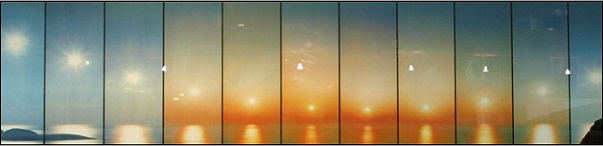

Each of the 11 shots in the series of photos was taken from the same location, with the camera always facing the Sun. The chronological order of the photos is from left to right. What was the time when the image of the Sun was the closest to the horizon? To which point of the compass did the camera face when the Sun was at its lowest position in the sky? Where and in which season was the series of photos taken?

 (4 pont)

