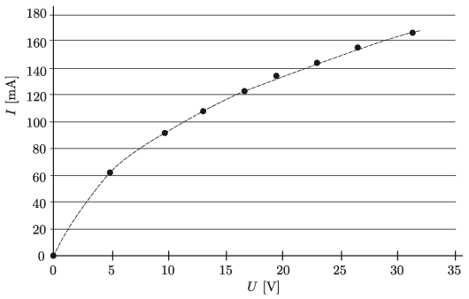

The figure shows the current-voltage characteristic of one of the tungsten filament bulbs of a string of a Christmas tree lights, which contains a hundred bulbs connected in series.

 $a)$ Using the graph determine the total dissipated electrical energy by all the bulbs of the string if it is connected to a voltage supply of 230V.
 $b)$ What is the total dissipated electrical energy by the string if it contains only ten bulbs and it is connected to 230 V?
 Note: In the second case the bulbs will quite soon burn out.
 (4 pont)

