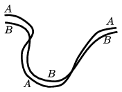

The figure shows the wet track of a bicycle on a dry asphalt after the bicycle passed a puddle. Did the bike move from the left to the right or from the right to the left? Which trail was made by the front wheel and which one was made by the rear one?

 (3 pont)

