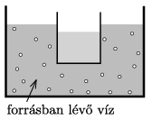

Boil water in a large pot on the stove. Put some cool water in a thin-walled glass, then immerse the glass of water into the boiling water so that it does not touch the walls of the pot. Will the water in the glass boil if we wait for a long enough time?

 (3 pont)

