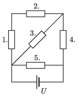

Each resistor in the circuit shown in the figure has a resistance of $6~\mathrm{k}\Omega$ and the voltage of the battery is $U = 60$ V. How many times more heat is dissipated in the resistor that heats up the most than in the one that heats up the least?

 (4 pont)

