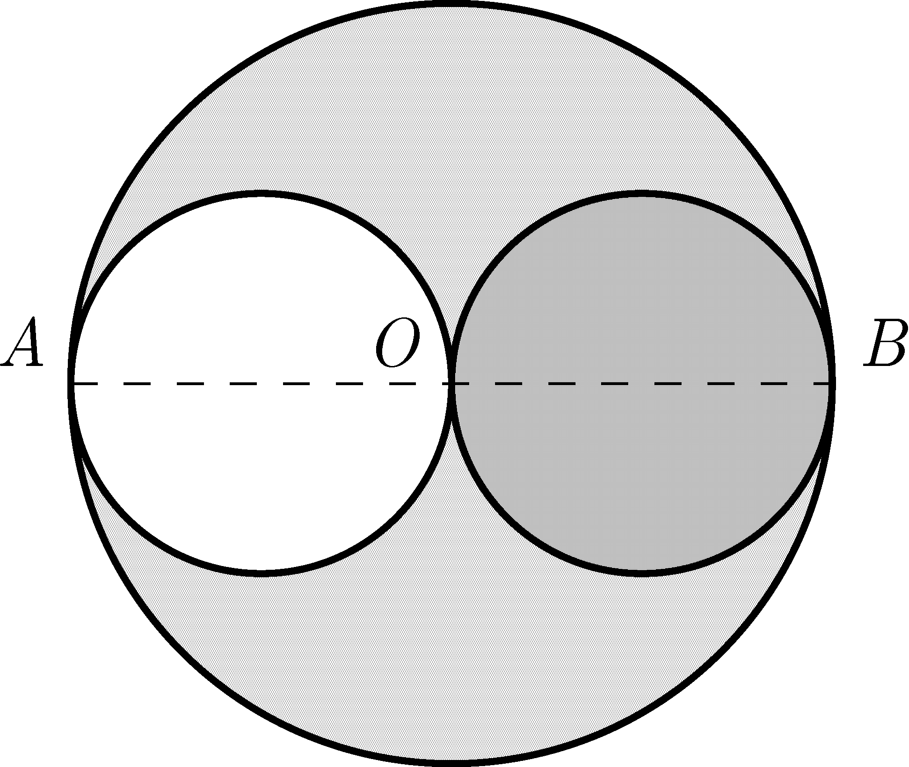

From a circular plate of radius $R=2r$, which has uniform mass distribution, another circular plate of radius $r$ was cut off along the diameter $AOB$ as shown in the figure . This smaller plate was laid on the bigger one on the other side of the diameter $AOB$. Where is the centre of mass of the resulting object?

 (4 pont)

