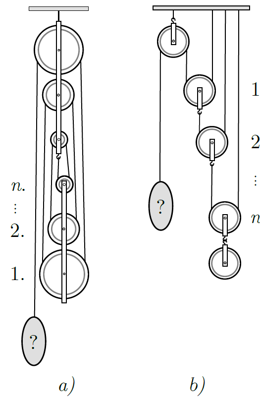

A pulley system consists of $n$ pulleys. Regardless of their size each moving pulley has the same weight of $G$, and the rope can be considered ideal. How much weight should be hung on the end of the rope so that the system is in equilibrium if the pulley system
 $a)$ is not loaded, and arranged as shown in figure $a)$ ;
 $b)$ is loaded with a pulley of weight $G$ and the pulleys are arranged as shown in figure $b)$ ?

 (4 pont)

