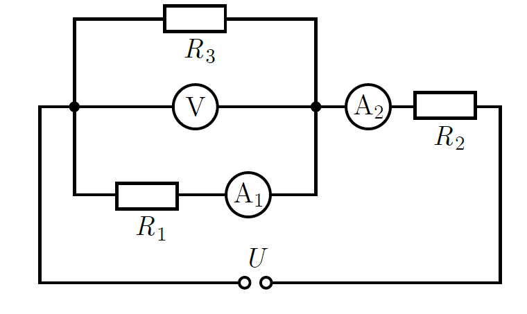

In the circuit shown in the schematic diagram, a power source supplies $U=24~\mathrm{V}$ DC voltage, the voltmeter reads $10~\mathrm{V}$, ammeter $\mathrm{A}_1$ reads $0.2~\mathrm{A}$, and ammeter $\mathrm{A}_2$ reads $0.7~\mathrm{A}$.

 $a)$ Determine the resistance of each resistor.
 $b)$ How much heat is dissipated in the circuit during 2 minutes?
 All three meters can be considered ideal, and the resistance of the connecting wires and the internal resistance of the power source are negligible.
 (4 pont)

