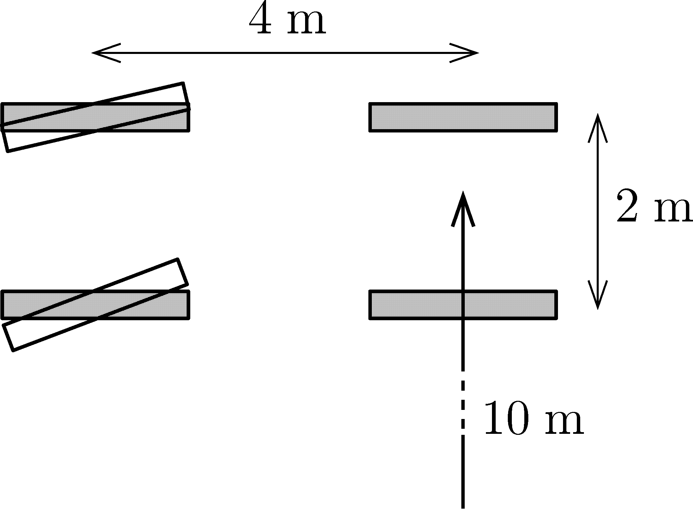

A car's front and rear wheels are at the vertices of a rectangle with sides 4 m and 2 m, as shown in the figure .

 a)  If the centre of the line segment between the rear wheels turns around a circle of radius $R=10~\mathrm{m}$ when the car turns, what is the radius of the circles drawn by the wet wheels of the car on the dry asphalt?
 b)  During turning, what is the angle turned by the front wheels about the vertical axis?
 (3 pont)

