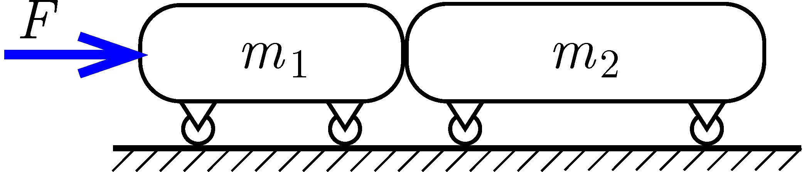

Two trolleys are standing close together on a horizontal track. One weighs 100 g, the other 150 g. The trolleys can move on the track without friction. The larger trolley is pushed by the smaller trolley such that a horizontal force of magnitude $0.5\,\mathrm{N}$ is exerted on the smaller trolley, as shown in the figure .
 a) What is the common acceleration of the trolleys?
 b) What is the normal force exerted between the trolleys?
 c) Do the answers to the previous two questions change if the horizontal force of $0.5\,\mathrm{N}$ is exerted on the larger trolley towards the smaller trolley?

 (4 pont)

