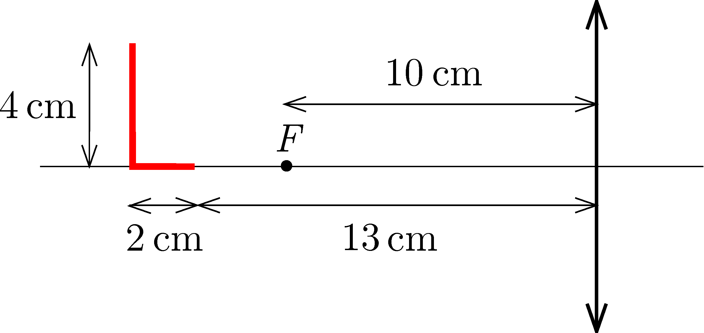

An L-shaped luminous LED strip is mounted on the principal axis of a thin converging lens of focal length 10 cm. The longer, 4 cm long leg of the L-shape is perpendicular to the principal axis, and the shorter, 2 cm long leg is aligned with the principal axis such that its end point is $13~\mathrm{cm}$ away from the lens, as shown in the figure .
 a) Construct the schematic image of the LED strip formed by the lens.
 b) Calculate the length of the two parts of the image of the LED strip, the one which is parallel and the other which is perpendicular to the principal axis of the lens. What is the magnification of these parts?

 (4 pont)

