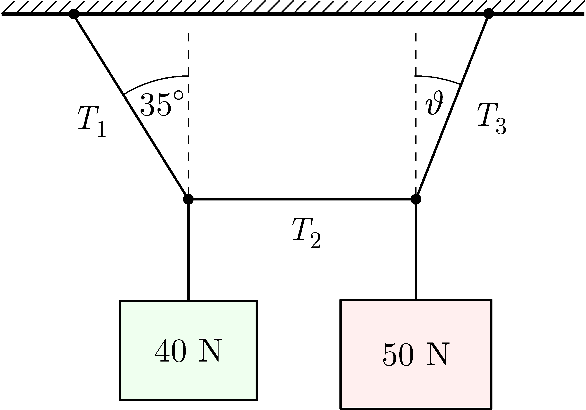

The system shown in the figure is in equilibrium, the rope in the middle is horizontal.

 a)  On graph paper construct the forces with a ruler and a protractor to determine the tension exerted in the ropes and the value of the unknown angle $\vartheta$.
 b)  Estimate the percentage error of the constructed quantities.
 (4 pont)

