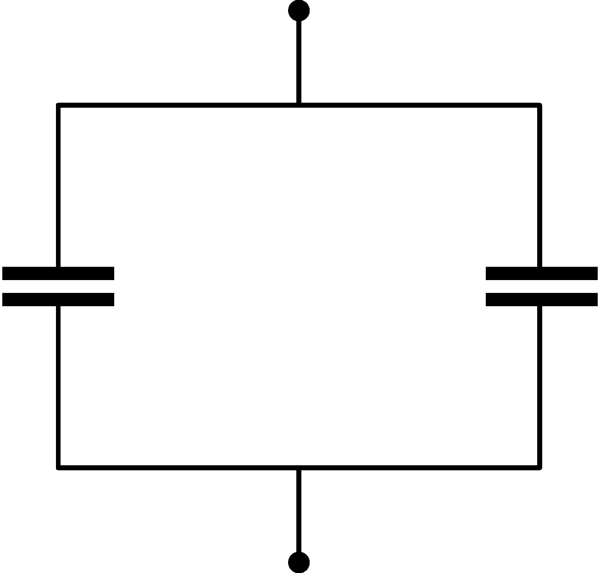

Two identical parallel plate capacitors are connected in parallel, as shown in the figure . They are charged to 200 V and then the voltage source is disconnected. Then the distance between the plates of one of the capacitors is doubled and that of the other is halved. (There's air between the plates.)

 a) By what factor does the equivalent capacitance of the system change?
 b) What will the voltage be?
 c) By what percentage does the energy stored in each capacitor change?
 (4 pont)

