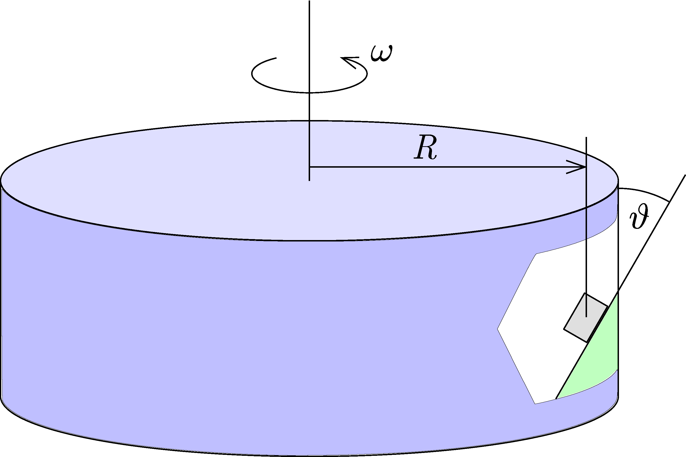

In an amusement park inside a giant rotating cylinder, people cling to a slant surface attached to the cylinder's mantle. The radius of the cylinder is $R=5\,\mathrm{m}$, the coefficient of static friction is $\mu=0.25$, and the slant surface makes an angle of $\vartheta=30^{\circ}$ with the vertical as shown in the figure .

 a)  What is the minimum and maximum angular speed of the cylinder so that people do not slide up or down?
 b)  What is the coefficient of friction such that people do not slip off at any small angular velocity?
 c)  What is the coefficient of friction such that people do not slide upwards at any angular velocity?
 (4 pont)

