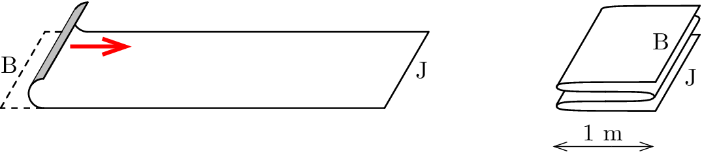

A 4 m long carpet lies on the floor of the corridor. Fold the carpet (in four equal layers) by holding the left edge (B) and move it continuously horizontally at a speed of 20 cm/s first to the right, then to the left and then to the right again (see the figure ).
 a) How long does it take to fold the carpet?
 b) After 5 s from the start of folding, what length of the carpet has a rightward velocity? The carpet is made of thin, easy to fold material, and does not slide on the floor. The changes in the direction of the motion are momentary.

 (4 pont)

