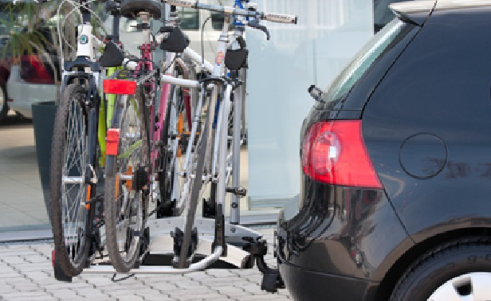

A car of weight $16\,000~\mathrm{N}$ is standing on a horizontal surface. All four wheels of the car push the ground with the same force. A bicycle carrier is then attached to the hitch of the car, to which three bicycles are attached symmetrically, as shown in the picture (i.e. the load is applied to the centre of the bicycle carrier).

 By how much does the force exerted by the wheels of the car on the ground change?
 The three bicycles and the bicycle carrier together weigh $800~\mathrm{N}$, the line of action is at a distance of $30~\mathrm{cm}$ from the ball of the hitch. The distance between the front and rear axles of the car is $2.8~\mathrm{m}$, the ball of the hitch is $1~\mathrm{m}$ horizontally from the rear axle.
 (3 pont)

