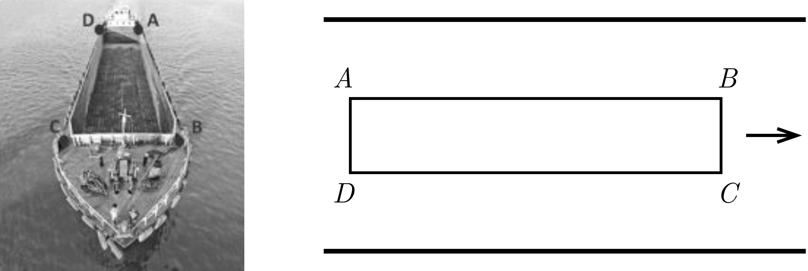

The sailor of a river barge is inspecting the deck of the barge and is walking at a speed of $3.6~\mathrm{km/h}$ along the route $A$-$B$-$C$-$D$-$A$. (See the figure; $AB=CD=75~\mathrm{m}$, $BC=AD=15~\mathrm{m}$.) The barge is travelling at a speed of $3.6~\mathrm{km/h}$ relative to the riverbank.

 a) How many minutes does it take for the sailor to complete his inspection route?
 b) What is the distance covered by the sailor relative to an observer on the riverbank while the sailor goes around the deck once?
 c) Plot the sailor's path relative to the observer on the riverbank.
 (4 pont)

