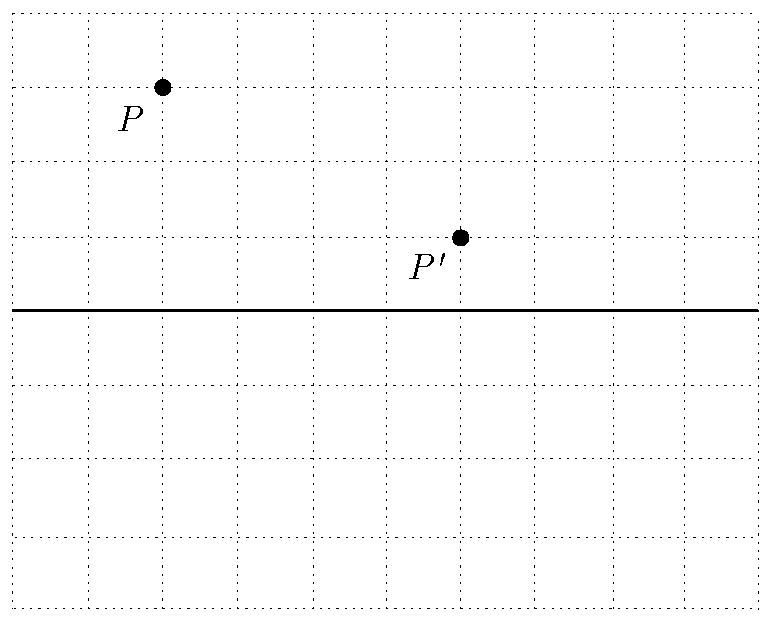

The virtual image of point $P$ produced by a thin diverging lens is at point $P'$ as shown in the figure . The principal axis of the lens is marked by a continuous line, and each division on the grid corresponds to $10~\mathrm{cm}$ horizontally and $1~\mathrm{cm}$ vertically. What is the focal length of the lens?

 (4 pont)

