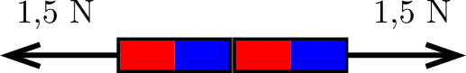
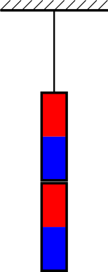

Two identical bar magnets each have a weight of 0.5 N. If the magnets, placed in contact with each other, are set on a horizontal frictionless table, they can be separated by a horizontal force of 1.5 N (see figure 1 ).

 figure 1
 The magnets are suspended as shown in figure 2 .

 figure 2
 a)  Determine the tension in the string and the contact force between the magnets.
 b)  Solve the problem also for the case in which one magnet has a weight of 0.5 N and the other 1 N, while the attractive force between them remains 1.5 N.

 (3 pont)

